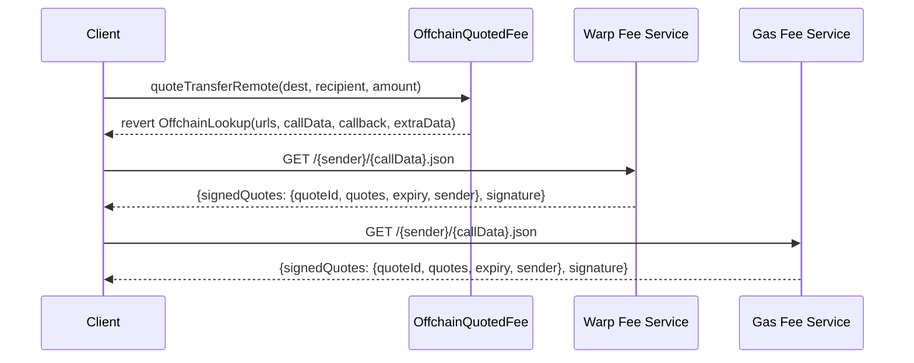
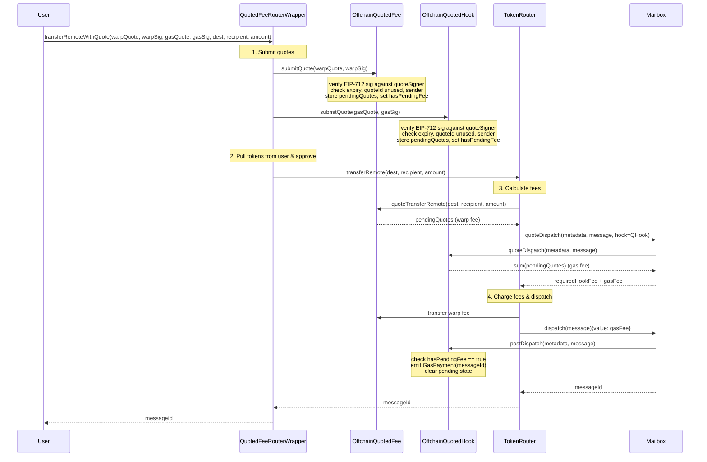
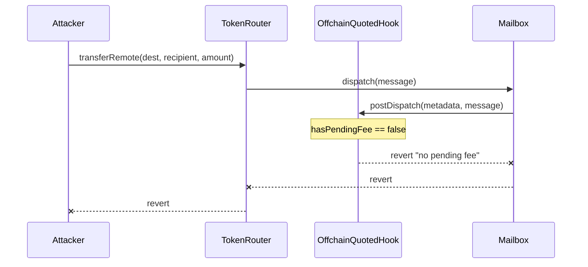

# Real-Time Warp Route Fees via Offchain Quoting

## Context

Current warp route fees use onchain-configured models (Linear, Progressive, Regressive) and StorageGasOracle for IGP. These can't react to real-time market conditions. This leads to overpaying or failed relaying.

**Goal**: Offchain quoting service signs real-time fee quotes; onchain contracts verify signatures and return the authorized quote. Uses CCIP-Read (ERC-3668) for quote discovery.

**Key requirements**:

- Differential pricing per user/frontend/partner (offchain logic)
- Independent signatures for IGP and warp fee
- Abstract base contract shared by both fee types

## Architecture

### Contract Hierarchy

```
AbstractOffchainQuoter (abstract)
  ├── handles EIP-712 signature verification
  ├── manages consumedQuotes[quoteId] mapping
  ├── stores/retrieves pending quote amount (set before transfer, cleared after)
  ├── reentrancy guard for quote lifecycle
  └── CCIP-Read OffchainLookup support

OffchainQuotedFee is AbstractOffchainQuoter, ITokenFee
  ├── set as feeRecipient on warp route
  ├── quoteTransferRemote() → returns pending amount or OffchainLookup
  └── claim() for fee collection

OffchainQuotedHook is AbstractOffchainQuoter, AbstractPostDispatchHook
  ├── set as hook on warp route (replaces IGP)
  ├── _quoteDispatch() → returns pending amount
  ├── _postDispatch() → bypass prevention, clears state
  └── claim() for fee collection

QuotedFeeRouterWrapper
  ├── user entry point (transferRemoteWithQuote)
  ├── calls quotedFee.submitQuote() + quotedHook.submitQuote()
  ├── then calls warpRoute.transferRemote()
  └── owns token handling (pull from user, approve to warp route)
```

### `AbstractOffchainQuoter`

```solidity
abstract contract AbstractOffchainQuoter is Ownable, EIP712 {
    // --- Storage ---
    address public quoteSigner;
    mapping(bytes32 => bool) public consumedQuotes;
    uint256 public defaultFee;
    string[] internal _urls;

    // --- Mid-transfer state (cleared after use) ---
    Quote[] internal _pendingQuotes;
    bool internal _hasPendingFee;

    // --- Signed quote ---
    struct SignedQuotes {
        bytes32 quoteId;    // unique, one-use
        Quote[] quotes;     // {token, amount} pairs — returned verbatim
        uint256 expiry;     // deadline
        address sender;     // front-running protection
    }

    // --- Core functions ---

    /// @notice Verify signature, mark quoteId consumed, store pending quotes
    function submitQuote(SignedQuotes calldata sq, bytes calldata signature) external {
        require(!_hasPendingFee, "reentrancy");
        require(block.timestamp <= sq.expiry, "expired");
        require(!consumedQuotes[sq.quoteId], "consumed");
        require(sq.sender == tx.origin, "sender mismatch");
        // Verify EIP-712 signature (domain separator scopes to this contract)
        address signer = ECDSA.recover(_hashTypedDataV4(hashSignedQuotes(sq)), signature);
        require(signer == quoteSigner, "invalid signer");

        consumedQuotes[sq.quoteId] = true;
        _pendingQuotes = sq.quotes;
        _hasPendingFee = true;
    }

    /// @notice Get pending quotes (for use by quoteTransferRemote / _quoteDispatch)
    function _getPendingQuotes() internal view returns (Quote[] memory) {
        return _hasPendingFee ? _pendingQuotes : _defaultQuotes();
    }

    /// @notice Clear pending state after transfer completes
    function _clearPendingFee() internal {
        _pendingFeeAmount = 0;
        _hasPendingFee = false;
    }

    /// @notice Check if there's a pending fee (for bypass prevention)
    function _requireAndClearPendingFee() internal {
        require(_hasPendingFee, "no pending fee");
        _clearPendingFee();
    }

    // Admin
    function setQuoteSigner(address _signer) external onlyOwner { ... }
    function setDefaultFee(uint256 _fee) external onlyOwner { ... }
    function setUrls(string[] memory __urls) external onlyOwner { ... }
}
```

### `OffchainQuotedFee`

```solidity
contract OffchainQuotedFee is AbstractOffchainQuoter, ITokenFee {
    function quoteTransferRemote(uint32, bytes32, uint256)
        external view returns (Quote[] memory)
    {
        if (_hasPendingFee) return _getPendingQuotes();
        // CCIP-Read fallback
        revert OffchainLookup(...);
    }

    function claim(address beneficiary) external onlyOwner { ... }
}
```

### `OffchainQuotedHook`

```solidity
contract OffchainQuotedHook is AbstractOffchainQuoter, AbstractPostDispatchHook {
    function _quoteDispatch(bytes calldata, bytes calldata)
        internal view override returns (uint256)
    {
        // Sum all quote amounts (hook returns single uint256)
        Quote[] memory quotes = _getPendingQuotes();
        uint256 total;
        for (uint256 i; i < quotes.length; i++) total += quotes[i].amount;
        return total;
    }

    function _postDispatch(bytes calldata metadata, bytes calldata message)
        internal override
    {
        _requireAndClearPendingFee();  // bypass prevention
        // emit event with message.id() for relayer indexing
    }

    function claim(address beneficiary) external onlyOwner { ... }
}
```

### `QuotedFeeRouterWrapper`

```solidity
contract QuotedFeeRouterWrapper is Ownable {
    TokenRouter public immutable warpRoute;
    OffchainQuotedFee public immutable quotedFee;
    OffchainQuotedHook public immutable quotedHook;
    IERC20 public immutable token;
    TokenType public immutable tokenType;

    function transferRemoteWithQuote(
        SignedQuotes calldata warpQuote, bytes calldata warpSig,
        SignedQuotes calldata gasQuote, bytes calldata gasSig,
        uint32 destination, bytes32 recipient, uint256 amount
    ) external payable returns (bytes32) {
        // 1. Submit both quotes (sets pending fees)
        quotedFee.submitQuote(warpQuote, warpSig);
        quotedHook.submitQuote(gasQuote, gasSig);

        // 2. Pull tokens from user, approve to warp route
        // (collateral/synthetic/native handling)

        // 3. Call warp route — internally reads pending fees
        bytes memory encoded = abi.encodeWithSelector(
            TokenRouter.transferRemote.selector, destination, recipient, amount
        );
        (bool ok, bytes memory ret) = address(warpRoute).call{value: msg.value}(encoded);
        require(ok);

        return abi.decode(ret, (bytes32));
    }

    // Escape hatch
    function execute(address target, bytes calldata data, uint256 value) external onlyOwner { ... }
}
```

### Sequence Diagrams

#### Quote Discovery (CCIP-Read)



#### Transfer Execution



#### Bypass Attempt (Reverts)



### Signed Quote (EIP-712)

```solidity
struct SignedQuotes {
    bytes32 quoteId;    // unique, one-use
    Quote[] quotes;     // array of {token, amount} — directly returned by quoteTransferRemote
    uint256 expiry;     // deadline
    address sender;     // front-running protection
}

// Where Quote is the existing:
struct Quote {
    address token;      // address(0) for native
    uint256 amount;
}
```

Signs over the exact `Quote[]` array that gets returned by `quoteTransferRemote()` or consumed by `_quoteDispatch()`. Benefits:

- Multi-token fee support natively (Quote array already supports multiple denominations)
- Direct passthrough — no translation between signed data and return value
- Bound to verifying contract via EIP-712 domain separator `(chainId, address(this))` — same struct used for both warp fee and gas fee, naturally scoped to each contract. A signature for `OffchainQuotedFee` at address X is invalid for `OffchainQuotedHook` at address Y.

### Deployment

1. Deploy `OffchainQuotedFee(token, signer, urls)`
2. Deploy `OffchainQuotedHook(signer, urls)`
3. Deploy `QuotedFeeRouterWrapper(warpRoute, quotedFee, quotedHook)`
4. `warpRoute.setFeeRecipient(quotedFee)`
5. `warpRoute.setHook(quotedHook)`
6. Grant `submitQuote` access to wrapper (or make it permissionless since quote has sender check)

### Relayer Dual-Mode

- **Quoted mode**: `hookType()` == `OFFCHAIN_QUOTED_HOOK`. No IGP check.
- **IGP mode**: Standard IGP. Business as usual.

### Offchain Service(s)

**Warp fee service** (route operator): signs `FeeQuote` for warp margin.
**Gas fee service** (relayer): signs `FeeQuote` for relay cost + margin.

Both CCIP-Read compatible, EIP-712 signing, configurable TTL.

## Files to Create/Modify

| File                                                             | Action                          |
| ---------------------------------------------------------------- | ------------------------------- |
| `solidity/contracts/hooks/AbstractOffchainQuoter.sol`            | Create — abstract base          |
| `solidity/contracts/token/fees/OffchainQuotedFee.sol`            | Create — ITokenFee impl         |
| `solidity/contracts/hooks/OffchainQuotedHook.sol`                | Create — IPostDispatchHook impl |
| `solidity/contracts/token/extensions/QuotedFeeRouterWrapper.sol` | Create — entry point            |
| `solidity/contracts/interfaces/hooks/IPostDispatchHook.sol`      | Modify — add hook type          |
| `solidity/test/token/OffchainQuoting.t.sol`                      | Create — Forge tests            |

## Key Files to Reference

- `solidity/contracts/token/extensions/PredicateRouterWrapper.sol` — wrapper pattern
- `solidity/contracts/isms/ccip-read/AbstractCcipReadIsm.sol` — OffchainLookup pattern
- `solidity/contracts/hooks/igp/InterchainGasPaymaster.sol` — IGP hook model
- `solidity/contracts/token/libs/TokenRouter.sol` — fee paths
- `solidity/contracts/token/fees/BaseFee.sol` — ITokenFee interface
- `solidity/contracts/hooks/libs/AbstractPostDispatchHook.sol` — hook base

## Verification

1. Unit: AbstractOffchainQuoter — sig verify, quoteId replay, expiry, sender check, reentrancy
2. Integration: OffchainQuotedFee returns pending fee via quoteTransferRemote
3. Integration: OffchainQuotedHook returns pending fee via \_quoteDispatch, clears in \_postDispatch
4. E2E: wrapper submits both quotes, warpRoute reads both fees, dispatch succeeds
5. Security: bypass (direct warpRoute call) → \_postDispatch reverts, wrong signer → reverts

## Unresolved Questions

None.
