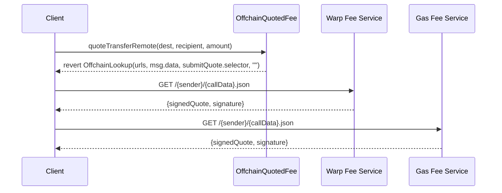
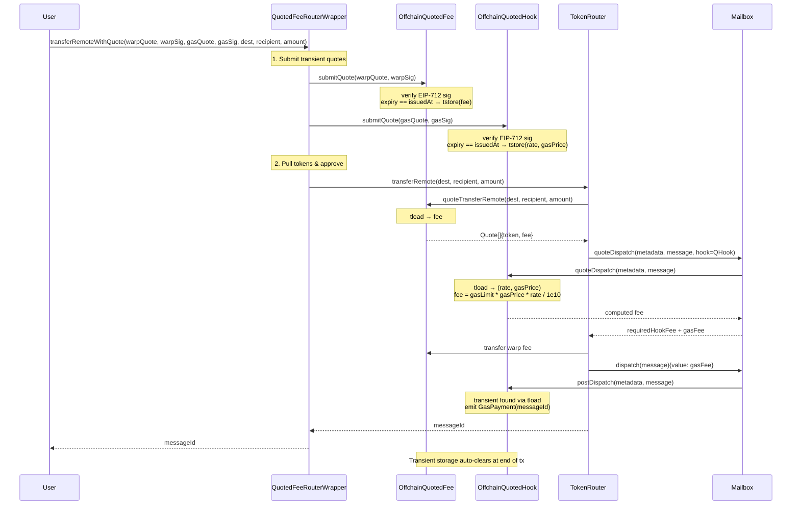
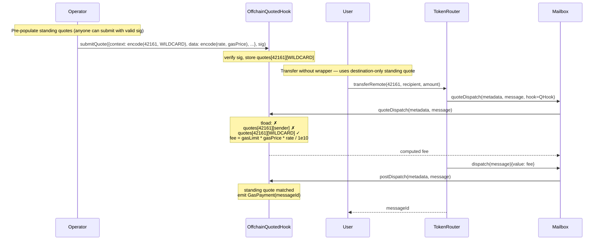
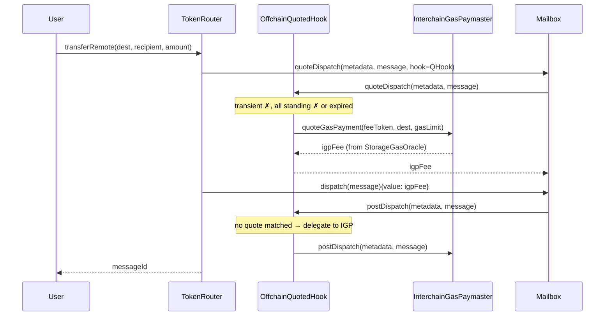

# Real-Time Warp Route Fees via Offchain Quoting

## Context

Current warp route fees use onchain-configured models (Linear, Progressive, Regressive) and StorageGasOracle for IGP. These can't react to real-time market conditions. This leads to overpaying or failed relaying.

**Goal**: Offchain quoting service signs real-time fee quotes; onchain contracts verify signatures and return the authorized quote. Uses CCIP-Read (ERC-3668) for quote discovery.

**Key requirements**:

- Differential pricing per user/frontend/partner (entirely offchain logic)
- Independent signatures for IGP and warp fee (separate signers, services, expiry)
- Minimal shared abstract base (sig verification + transient/standing routing)
- Multi-level quote matching with compound key support via nested mappings
- Requires Cancun (EIP-1153 transient storage)

## Signed Quote (EIP-712)

Single unified struct for all quote types:

```solidity
struct SignedQuote {
    bytes context;      // ABI-encoded calldata (keys for storage lookup)
    bytes data;         // quote payload — contract-specific encoding
    uint48 issuedAt;    // ordering for standing quotes
    uint48 expiry;      // == issuedAt means transient
}
```

**Quote data formats** (contract-specific):

- **IGP**: `abi.encode(uint128 tokenExchangeRate, uint128 gasPrice)` — packs into a single slot. Fee computed as `gasLimit * gasPrice * tokenExchangeRate / SCALE`, preserving variable gasLimit support.
- **Warp fee**: `abi.encode(uint256 fee)` — flat fee amount. Single slot.

**Transient vs standing**:

- **Transient**: `expiry == issuedAt`. Stored in transient storage (EIP-1153). Auto-clears at end of tx. No reentrancy guard or client restriction needed.
- **Standing**: `expiry > issuedAt`. Stored in regular storage. Reusable until expiry. Replaced only by newer `issuedAt`.

**Context is ABI-encoded calldata**: For warp fee, context is `msg.data` from `quoteTransferRemote(destination, recipient, amount)` — flows naturally through CCIP-Read. For IGP, context is a lightweight key encoding `abi.encodeWithSelector(selector, destination, sender)`. Each concrete contract decodes context to extract mapping keys. Wildcards use `type(T).max`.

**CCIP-Read alignment**: The `callData` in `OffchainLookup` revert is `msg.data`. The offchain service receives it, computes the fee, and signs it back as `context`. The callback is `submitQuote` itself. One encoding scheme end-to-end.

**EIP-712 domain separator** binds signature to `(chainId, verifyingContract)` — prevents cross-contract and cross-chain replay.

## Multi-Level Quote Matching

Each contract uses a nested mapping keyed by two dimensions decoded from `context`. Wildcards (`type(T).max`) match any value. Resolution checks specific keys first, then wildcards, then fallback.

### IGP Hook (`OffchainQuotedHook`)

```solidity
// data[destination][sender] — stores (tokenExchangeRate, gasPrice)
mapping(uint32 => mapping(address => StoredQuote)) public quotes;
```

| Priority | Lookup                          | Semantics                              |
| -------- | ------------------------------- | -------------------------------------- |
| 1        | transient (tload)               | Real-time quote, tx-scoped             |
| 2        | `quotes[destination][sender]`   | Specific destination-sender rate       |
| 3        | `quotes[destination][WILDCARD]` | Destination-only rate (any sender)     |
| 4        | `quotes[WILDCARD][sender]`      | Sender-only rate (any destination)     |
| 5        | `igp.quoteGasPayment()`         | Existing IGP/StorageGasOracle fallback |

### Warp Fee (`OffchainQuotedFee`)

```solidity
// data[destination][recipient] — stores fee amount
mapping(uint32 => mapping(bytes32 => StoredQuote)) public quotes;
```

| Priority | Lookup                           | Semantics                             |
| -------- | -------------------------------- | ------------------------------------- |
| 1        | transient (tload)                | Real-time quote, tx-scoped            |
| 2        | `quotes[destination][recipient]` | Specific destination-recipient rate   |
| 3        | `quotes[destination][WILDCARD]`  | Destination-only rate (any recipient) |
| 4        | `quotes[WILDCARD][recipient]`    | Recipient-only rate (any destination) |
| 5        | revert `OffchainLookup`          | CCIP-Read fallback                    |

### Properties

- **No replay protection needed** — transient quotes auto-clear (EIP-1153), standing quotes are intentionally reusable
- **No client/reentrancy guard needed** — transient storage is tx-scoped, invisible to other txs
- **Graceful degradation** — falls back through specificity levels to IGP / CCIP-Read
- **Compound matching** — Alice-to-Arbitrum, Alice-to-any, anyone-to-Arbitrum all coexist
- **Permissionless submission** — anyone can submit any signed quote (signer's signature is the authorization)
- **Users can transfer without the wrapper** if a matching standing quote exists

## Architecture

### Contract Hierarchy

```
AbstractOffchainQuoter (abstract, EIP712)
  ├── EIP-712 signature verification
  ├── unified submitQuote() — routes transient (tstore) vs standing (sstore)
  ├── abstract _storeStanding() / _tstore() / _tload()
  └── admin: quoteSigner, urls

OffchainQuotedFee is AbstractOffchainQuoter, ITokenFee
  ├── quotes[destination][recipient] nested mapping
  ├── data = uint256 fee
  ├── resolution: transient → specific → destination-only → recipient-only → CCIP-Read
  ├── quoteTransferRemote() → resolves and returns Quote[]
  └── claim() for fee collection

OffchainQuotedHook is AbstractOffchainQuoter, AbstractPostDispatchHook
  ├── quotes[destination][sender] nested mapping
  ├── data = (uint128 tokenExchangeRate, uint128 gasPrice)
  ├── fallback: delegates to existing IGP (StorageGasOracle)
  ├── resolution: transient → specific → destination-only → sender-only → IGP
  ├── _quoteDispatch() → resolves and computes gasLimit * gasPrice * rate
  ├── _postDispatch() → delegates to IGP if no quote matched
  └── claim() for fee collection

QuotedFeeRouterWrapper
  ├── user entry point (transferRemoteWithQuote)
  ├── submits transient quotes to quotedFee + quotedHook
  ├── then calls warpRoute.transferRemote()
  ├── token handling (pull from user, approve to warp route)
  └── execute() escape hatch for owner
```

### `AbstractOffchainQuoter`

```solidity
abstract contract AbstractOffchainQuoter is Ownable, EIP712 {
    address public quoteSigner;
    string[] internal _urls;

    struct StoredQuote {
        bytes data;         // contract-specific payload
        uint48 issuedAt;
        uint48 expiry;
    }

    function submitQuote(
        SignedQuote calldata sq, bytes calldata signature
    ) external {
        require(uint48(block.timestamp) <= sq.expiry, "expired");
        _verifySigner(sq, signature);

        if (sq.expiry == sq.issuedAt) {
            // Transient — tstore (tx-scoped, auto-clears)
            _tstoreQuote(sq);
        } else {
            // Standing — regular storage
            _storeStanding(sq);
        }
    }

    // --- Abstract: concrete contracts implement storage ---
    function _storeStanding(SignedQuote calldata sq) internal virtual;
    function _tstoreQuote(SignedQuote calldata sq) internal virtual;
    function _tloadQuote() internal view virtual returns (bytes memory data, bool found);

    // --- Standing helper ---
    function _resolveStored(StoredQuote storage sq)
        internal view returns (bytes memory data, bool found)
    {
        if (sq.expiry > 0 && uint48(block.timestamp) <= sq.expiry) {
            return (sq.data, true);
        }
        return (data, false);
    }

    // --- Admin ---
    function setQuoteSigner(address _signer) external onlyOwner { ... }
    function setUrls(string[] memory __urls) external onlyOwner { ... }
}
```

### `OffchainQuotedFee`

```solidity
contract OffchainQuotedFee is AbstractOffchainQuoter, ITokenFee {
    uint32 constant WILDCARD_DEST = type(uint32).max;
    bytes32 constant WILDCARD_RECIPIENT = type(bytes32).max;

    mapping(uint32 => mapping(bytes32 => StoredQuote)) public quotes;

    // Transient storage: single uint256 fee slot
    uint256 constant TRANSIENT_FEE_SLOT = uint256(keccak256("OffchainQuotedFee.transientFee"));
    uint256 constant TRANSIENT_HAS_SLOT = uint256(keccak256("OffchainQuotedFee.hasTransient"));

    function _tstoreQuote(SignedQuote calldata sq) internal override {
        uint256 fee = abi.decode(sq.data, (uint256));
        assembly {
            tstore(TRANSIENT_FEE_SLOT, fee)
            tstore(TRANSIENT_HAS_SLOT, 1)
        }
    }

    function _tloadQuote() internal view override returns (bytes memory data, bool found) {
        uint256 has; uint256 fee;
        assembly {
            has := tload(TRANSIENT_HAS_SLOT)
            fee := tload(TRANSIENT_FEE_SLOT)
        }
        if (has == 1) return (abi.encode(fee), true);
        return (data, false);
    }

    function _storeStanding(SignedQuote calldata sq) internal override {
        (, uint32 dest, bytes32 recipient,) =
            abi.decode(sq.context[4:], (uint32, bytes32, uint256));
        StoredQuote storage existing = quotes[dest][recipient];
        require(sq.issuedAt > existing.issuedAt, "stale");
        quotes[dest][recipient] = StoredQuote(sq.data, sq.issuedAt, sq.expiry);
    }

    function quoteTransferRemote(uint32 _destination, bytes32 _recipient, uint256)
        external view returns (Quote[] memory result)
    {
        uint256 fee;
        bool found;

        // 1. Transient
        (bytes memory data, bool tFound) = _tloadQuote();
        if (tFound) { fee = abi.decode(data, (uint256)); found = true; }

        // 2. Specific: destination + recipient
        if (!found) {
            (data, found) = _resolveStored(quotes[_destination][_recipient]);
            if (found) fee = abi.decode(data, (uint256));
        }

        // 3. Destination-only
        if (!found) {
            (data, found) = _resolveStored(quotes[_destination][WILDCARD_RECIPIENT]);
            if (found) fee = abi.decode(data, (uint256));
        }

        // 4. Recipient-only
        if (!found) {
            (data, found) = _resolveStored(quotes[WILDCARD_DEST][_recipient]);
            if (found) fee = abi.decode(data, (uint256));
        }

        if (found) {
            result = new Quote[](1);
            result[0] = Quote(token(), fee);
            return result;
        }

        // 5. CCIP-Read — msg.data is the context, submitQuote is the callback
        revert OffchainLookup(
            address(this), _urls, msg.data,
            this.submitQuote.selector, ""
        );
    }

    function claim(address beneficiary) external onlyOwner { ... }
}
```

### `OffchainQuotedHook`

```solidity
contract OffchainQuotedHook is AbstractOffchainQuoter, AbstractPostDispatchHook {
    uint32 constant WILDCARD_DEST = type(uint32).max;
    address constant WILDCARD_SENDER = address(type(uint160).max);

    mapping(uint32 => mapping(address => StoredQuote)) public quotes;

    InterchainGasPaymaster public immutable igp;

    // Transient storage: (uint128 tokenExchangeRate, uint128 gasPrice) packed in one slot
    uint256 constant TRANSIENT_DATA_SLOT = uint256(keccak256("OffchainQuotedHook.transientData"));
    uint256 constant TRANSIENT_HAS_SLOT = uint256(keccak256("OffchainQuotedHook.hasTransient"));

    constructor(address _igp, ...) {
        igp = InterchainGasPaymaster(_igp);
    }

    function _tstoreQuote(SignedQuote calldata sq) internal override {
        (uint128 rate, uint128 gasPrice) = abi.decode(sq.data, (uint128, uint128));
        uint256 packed = (uint256(rate) << 128) | uint256(gasPrice);
        assembly {
            tstore(TRANSIENT_DATA_SLOT, packed)
            tstore(TRANSIENT_HAS_SLOT, 1)
        }
    }

    function _tloadQuote() internal view override returns (bytes memory data, bool found) {
        uint256 has; uint256 packed;
        assembly {
            has := tload(TRANSIENT_HAS_SLOT)
            packed := tload(TRANSIENT_DATA_SLOT)
        }
        if (has == 1) {
            uint128 rate = uint128(packed >> 128);
            uint128 gasPrice = uint128(packed);
            return (abi.encode(rate, gasPrice), true);
        }
        return (data, false);
    }

    function _storeStanding(SignedQuote calldata sq) internal override {
        (, uint32 dest, address sender) =
            abi.decode(sq.context[4:], (uint32, address));
        StoredQuote storage existing = quotes[dest][sender];
        require(sq.issuedAt > existing.issuedAt, "stale");
        quotes[dest][sender] = StoredQuote(sq.data, sq.issuedAt, sq.expiry);
    }

    /// @notice Compute fee from (tokenExchangeRate, gasPrice) and gasLimit
    function _computeFee(bytes memory data, uint256 gasLimit) internal pure returns (uint256) {
        (uint128 rate, uint128 gasPrice) = abi.decode(data, (uint128, uint128));
        return (gasLimit * uint256(gasPrice) * uint256(rate)) / 1e10;
    }

    function _quoteDispatch(bytes calldata metadata, bytes calldata message)
        internal view override returns (uint256)
    {
        uint256 gasLimit = metadata.gasLimit(igp.DEFAULT_GAS_USAGE());
        address sender = message.senderAddress();
        uint32 dest = message.destination();

        // 1. Transient
        (bytes memory data, bool found) = _tloadQuote();
        if (found) return _computeFee(data, gasLimit);

        // 2. Specific: destination + sender
        (data, found) = _resolveStored(quotes[dest][sender]);
        if (found) return _computeFee(data, gasLimit);

        // 3. Destination-only
        (data, found) = _resolveStored(quotes[dest][WILDCARD_SENDER]);
        if (found) return _computeFee(data, gasLimit);

        // 4. Sender-only
        (data, found) = _resolveStored(quotes[WILDCARD_DEST][sender]);
        if (found) return _computeFee(data, gasLimit);

        // 5. IGP fallback
        return igp.quoteGasPayment(
            metadata.feeToken(address(0)), dest, gasLimit
        );
    }

    function _postDispatch(bytes calldata metadata, bytes calldata message)
        internal override
    {
        address sender = message.senderAddress();
        uint32 dest = message.destination();

        // Check if any offchain quote matched
        (, bool found) = _tloadQuote();
        if (!found) (, found) = _resolveStored(quotes[dest][sender]);
        if (!found) (, found) = _resolveStored(quotes[dest][WILDCARD_SENDER]);
        if (!found) (, found) = _resolveStored(quotes[WILDCARD_DEST][sender]);

        if (found) {
            emit GasPayment(message.id());
            return;
        }

        // Fallback: delegate to IGP
        igp.postDispatch(metadata, message);
    }

    function claim(address beneficiary) external onlyOwner { ... }
}
```

### `QuotedFeeRouterWrapper`

```solidity
contract QuotedFeeRouterWrapper is Ownable {
    TokenRouter public immutable warpRoute;
    OffchainQuotedFee public immutable quotedFee;
    OffchainQuotedHook public immutable quotedHook;
    IERC20 public immutable token;
    TokenType public immutable tokenType;

    function transferRemoteWithQuote(
        SignedQuote calldata warpQuote, bytes calldata warpSig,
        SignedQuote calldata gasQuote, bytes calldata gasSig,
        uint32 destination, bytes32 recipient, uint256 amount
    ) external payable returns (bytes32) {
        // 1. Submit transient quotes (tstore, tx-scoped)
        quotedFee.submitQuote(warpQuote, warpSig);
        quotedHook.submitQuote(gasQuote, gasSig);

        // 2. Pull tokens from user, approve to warp route

        // 3. Call warp route — internally resolves fees
        bytes memory encoded = abi.encodeWithSelector(
            TokenRouter.transferRemote.selector, destination, recipient, amount
        );
        (bool ok, bytes memory ret) = address(warpRoute).call{value: msg.value}(encoded);
        require(ok);

        return abi.decode(ret, (bytes32));
    }

    /// @notice Escape hatch for owner
    function execute(address target, bytes calldata data, uint256 value)
        external onlyOwner returns (bytes memory)
    {
        (bool ok, bytes memory ret) = target.call{value: value}(data);
        require(ok);
        return ret;
    }
}
```

## Sequence Diagrams

### Quote Discovery (CCIP-Read)



### Transfer with Transient Quote



### Transfer with Standing Quote (No Wrapper Needed)



### Transfer with IGP Fallback (No Quotes Match)



## Deployment

1. Deploy `OffchainQuotedFee(signer, urls)`
2. Deploy `OffchainQuotedHook(igp, signer, urls)`
3. Deploy `QuotedFeeRouterWrapper(warpRoute, quotedFee, quotedHook)`
4. `warpRoute.setFeeRecipient(address(quotedFee))`
5. `warpRoute.setHook(address(quotedHook))`
6. Pre-populate standing quotes for known routes

Existing warp routes can be "upgraded" to offchain quoting by setting the new fee recipient and hook — no redeployment of the warp route needed.

## Relayer Dual-Mode

Relayer detects mode per warp route:

- **Quoted mode**: `hookType()` == `OFFCHAIN_QUOTED_HOOK`. Relayer trusts the quoted fee covers gas. No IGP payment check.
- **IGP mode**: Standard `InterchainGasPaymaster` hook. Business as usual.

Both modes coexist across different warp routes.

## Offchain Quoting Service(s)

Can be one service or two independent services:

**Warp fee service** (operated by warp route owner):

- Computes protocol margin based on `(sender, clientId, amount, destination)`
- Signs quotes with `data = abi.encode(uint256 fee)`
- EIP-712 domain points to `OffchainQuotedFee` contract address

**Gas fee service** (operated by relayer):

- Fetches real-time gas prices, exchange rates from destination chain
- Signs quotes with `data = abi.encode(uint128 tokenExchangeRate, uint128 gasPrice)`
- Signs destination-only quotes periodically (auto-expiring, replaces manual StorageGasOracle updates)
- Signs sender-specific quotes for negotiated rates
- Signs transient quotes on-demand for real-time pricing
- Falls back to existing IGP (StorageGasOracle) as ultimate backstop when all signed quotes expired
- EIP-712 domain points to `OffchainQuotedHook` contract address

Both services: CCIP-Read compatible HTTP endpoints, EIP-712 signing, configurable TTL per level.

## Security Properties

| Property                  | Mechanism                                                        |
| ------------------------- | ---------------------------------------------------------------- |
| Cross-contract replay     | EIP-712 domain separator includes `verifyingContract`            |
| Cross-chain replay        | EIP-712 domain separator includes `chainId`                      |
| Transient isolation       | EIP-1153 transient storage — tx-scoped, invisible to other txs   |
| Quote expiry              | `uint48(block.timestamp) <= expiry` check on all levels          |
| Signer authorization      | `ECDSA.recover` against owner-configured `quoteSigner`           |
| Staleness prevention      | `issuedAt` must be > existing to replace standing quotes         |
| Permissionless submission | Anyone can submit signed quotes — signer's signature is the auth |

## Files to Create/Modify

| File                                                             | Action                          |
| ---------------------------------------------------------------- | ------------------------------- |
| `solidity/contracts/hooks/AbstractOffchainQuoter.sol`            | Create — abstract base          |
| `solidity/contracts/token/fees/OffchainQuotedFee.sol`            | Create — ITokenFee impl         |
| `solidity/contracts/hooks/OffchainQuotedHook.sol`                | Create — IPostDispatchHook impl |
| `solidity/contracts/token/extensions/QuotedFeeRouterWrapper.sol` | Create — entry point            |
| `solidity/contracts/interfaces/hooks/IPostDispatchHook.sol`      | Modify — add hook type          |
| `solidity/test/token/OffchainQuoting.t.sol`                      | Create — Forge tests            |

## Key References

- `solidity/contracts/token/extensions/PredicateRouterWrapper.sol` — wrapper pattern
- `solidity/contracts/isms/ccip-read/AbstractCcipReadIsm.sol` — OffchainLookup pattern
- `solidity/contracts/hooks/igp/InterchainGasPaymaster.sol` — IGP hook model, `quoteGasPayment` formula
- `solidity/contracts/token/libs/TokenRouter.sol` — `_feeRecipientAndAmount()`, `_quoteGasPayment()`
- `solidity/contracts/client/Router.sol` — `_Router_quoteDispatch()` → `mailbox.quoteDispatch()`
- `solidity/contracts/token/fees/BaseFee.sol` — ITokenFee interface
- `solidity/contracts/hooks/libs/AbstractPostDispatchHook.sol` — hook base
- `solidity/contracts/interfaces/ITokenBridge.sol` — `Quote` struct, `ITokenFee` interface

## Verification

1. **Unit**: `AbstractOffchainQuoter` — sig verify, expiry, transient vs standing routing
2. **Transient**: tstore/tload single-slot, auto-clears at end of tx, no cross-tx leakage
3. **IGP fee computation**: `gasLimit * gasPrice * tokenExchangeRate / 1e10` matches existing IGP formula
4. **Resolution order**: specific → dim1-wildcard → dim2-wildcard → fallback. Expired quotes skipped.
5. **Compound matching**: `quotes[42161][Alice]` takes priority over `quotes[42161][WILDCARD]`
6. **Integration**: `OffchainQuotedFee` resolves quotes via `quoteTransferRemote()`
7. **Integration**: `OffchainQuotedHook` resolves via `_quoteDispatch()`, delegates to IGP on miss
8. **Standing quotes**: Transfer succeeds with destination-only quote (no wrapper needed)
9. **Permissionless**: Anyone can submit signed standing quotes
10. **E2E**: Wrapper submits transient quotes, warp route reads fees, dispatch succeeds
