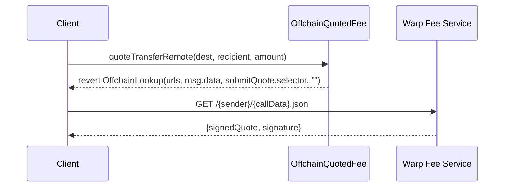
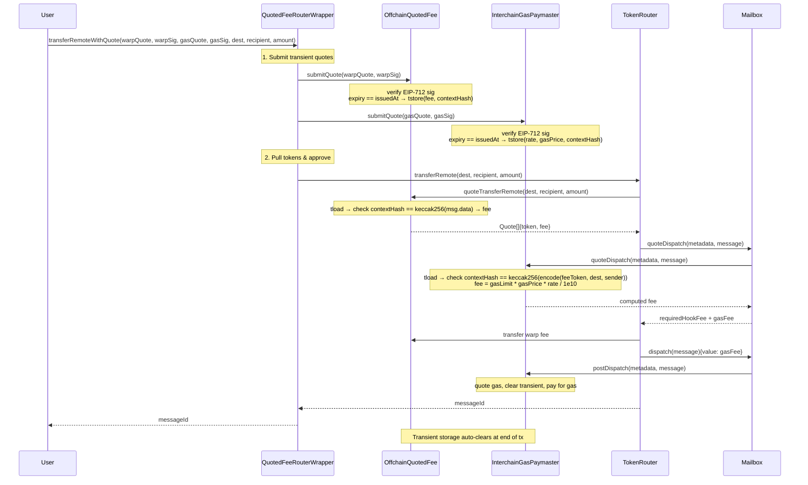
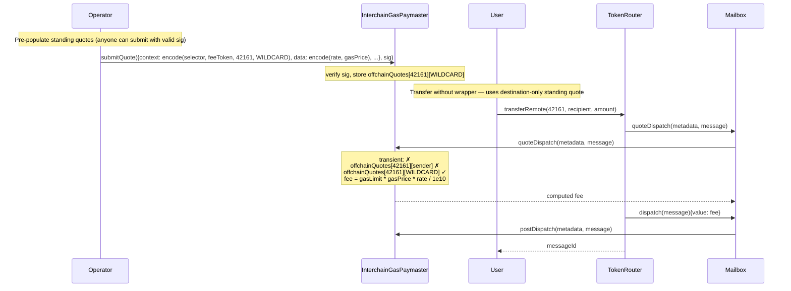
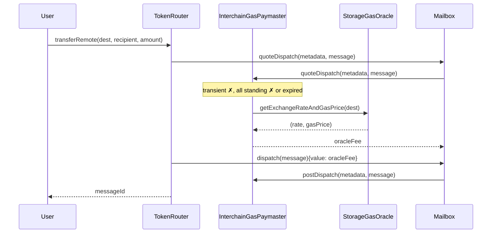

# Real-Time Warp Route Fees via Offchain Quoting

## Context

Current warp route fees use onchain-configured models (Linear, Progressive, Regressive) and StorageGasOracle for IGP. These can't react to real-time market conditions. This leads to overpaying or failed relaying.

**Goal**: Offchain quoting service signs real-time fee quotes; onchain contracts verify signatures and return the authorized quote. Uses CCIP-Read (ERC-3668) for quote discovery.

**Key requirements**:

- Differential pricing per user/frontend/partner (entirely offchain logic)
- Independent signatures for IGP and warp fee (separate signers, services, expiry)
- Minimal shared abstract base (sig verification + transient/standing routing)
- Multi-level quote matching with compound key support via nested mappings
- Context hash enforcement prevents transient quote reuse for different parameters
- Requires Cancun (EIP-1153 transient storage)

## Signed Quote (EIP-712)

Single unified struct for all quote types:

```solidity
struct SignedQuote {
    bytes context;      // ABI-encoded calldata (keys for storage lookup)
    bytes32 data;       // quote payload — single slot, contract-specific encoding
    uint48 issuedAt;    // ordering for standing quotes
    uint48 expiry;      // == issuedAt means transient
}
```

**Quote data formats** (`bytes32`, contract-specific packing):

- **IGP**: `bytes32((uint256(tokenExchangeRate) << 128) | uint256(gasPrice))` — two `uint128` values packed in one word. Fee computed as `gasLimit * gasPrice * tokenExchangeRate / SCALE`, preserving variable gasLimit support.
- **Warp fee**: `bytes32(uint256(fee))` — flat fee amount. `bytes32(0)` is invalid (zero fee = no quote).

**Transient vs standing**:

- **Transient**: `expiry == issuedAt`. Stored in transient storage (EIP-1153). Auto-clears at end of tx. Context hash stored alongside to prevent reuse for different call parameters.
- **Standing**: `expiry > issuedAt`. Stored in regular storage. Reusable until expiry. Replaced only by newer `issuedAt`.

**Context formats**:

- **Warp fee**: `context = msg.data` from `quoteTransferRemote(destination, recipient, amount)`. Flows naturally through CCIP-Read. Transient check: `keccak256(context) == keccak256(msg.data)`.
- **IGP**: `context = abi.encodeWithSelector(quoteGasPayment.selector, feeToken, destination, sender)`. Transient check: `keccak256(context) == keccak256(abi.encodeWithSelector(SELECTOR, feeToken, dest, msg.sender))`. Includes fee token to prevent cross-token reuse.

Each concrete contract decodes context to extract mapping keys for standing quotes. Wildcards use `type(T).max`.

**CCIP-Read alignment**: The `callData` in `OffchainLookup` revert is `msg.data`. The offchain service receives it, computes the fee, and signs it back as `context`. The callback is `submitQuote` itself.

**EIP-712 domain separator** binds signature to `(chainId, verifyingContract)` — prevents cross-contract and cross-chain replay.

## Multi-Level Quote Matching

Each contract uses a nested mapping keyed by two dimensions decoded from `context`. Wildcards (`type(T).max`) match any value. Resolution checks specific keys first, then wildcards, then fallback.

### IGP (InterchainGasPaymaster)

Offchain quoting is mixed into the existing `InterchainGasPaymaster` via `AbstractOffchainQuoter` inheritance.

```solidity
// Standing quotes: offchainQuotes[destination][sender]
mapping(uint32 => mapping(address => StoredGasQuote)) public offchainQuotes;

// Transient storage (tx-scoped, auto-clears)
uint128 transient _transientExchangeRate;   // 0 = no quote
uint128 transient _transientGasPrice;
bytes32 transient _transientContextHash;
```

| Priority | Lookup                                  | Semantics                              |
| -------- | --------------------------------------- | -------------------------------------- |
| 1        | transient (context hash must match)     | Real-time quote, tx-scoped             |
| 2        | `offchainQuotes[destination][sender]`   | Specific destination-sender rate       |
| 3        | `offchainQuotes[destination][WILDCARD]` | Destination-only rate (any sender)     |
| 4        | `offchainQuotes[WILDCARD][sender]`      | Sender-only rate (any destination)     |
| 5        | `tokenGasOracles` (existing oracle)     | Existing IGP/StorageGasOracle fallback |

The IGP clears transient storage after `_postDispatch` to prevent reuse within the same transaction.

### Warp Fee (OffchainQuotedFee)

```solidity
// Standing quotes: quotes[destination][recipient]
mapping(uint32 => mapping(bytes32 => StoredQuote)) public quotes;

// Transient storage
uint256 transient _transientFee;            // 0 = no quote
bytes32 transient _transientContextHash;
```

| Priority | Lookup                              | Semantics                             |
| -------- | ----------------------------------- | ------------------------------------- |
| 1        | transient (context hash must match) | Real-time quote, tx-scoped            |
| 2        | `quotes[destination][recipient]`    | Specific destination-recipient rate   |
| 3        | `quotes[destination][WILDCARD]`     | Destination-only rate (any recipient) |
| 4        | `quotes[WILDCARD][recipient]`       | Recipient-only rate (any destination) |
| 5        | revert `OffchainLookup`             | CCIP-Read fallback                    |

### Properties

- **No replay protection needed** — transient quotes auto-clear (EIP-1153), standing quotes are intentionally reusable
- **Context hash prevents parameter mismatch** — transient quote for `(dest=42, sender=Alice)` can't be used for `(dest=43, sender=Alice)`
- **Graceful degradation** — falls back through specificity levels to oracle / CCIP-Read
- **Compound matching** — Alice-to-Arbitrum, Alice-to-any, anyone-to-Arbitrum all coexist
- **Permissionless submission** — anyone can submit any signed quote (signer's signature is the authorization)
- **Users can transfer without the wrapper** if a matching standing quote exists

## Architecture

### Contract Hierarchy

```
AbstractOffchainQuoter (abstract, no storage)
  ├── EIP-712 signature verification (inline domain separator)
  ├── unified submitQuote() — verifies sig + expiry, routes transient vs standing
  ├── abstract _storeTransient() / _storeStanding() / _quoteSigner()
  └── QuoteSubmitted event

InterchainGasPaymaster is AbstractOffchainQuoter, AbstractPostDispatchHook, ...
  ├── offchainQuotes[destination][sender] nested mapping
  ├── data = bytes32(rate << 128 | gasPrice)
  ├── context = abi.encodeWithSelector(QUOTE_CONTEXT_SELECTOR, feeToken, dest, sender)
  ├── resolution: transient → specific → dest-only → sender-only → tokenGasOracles
  ├── quoteGasPayment() → resolves and computes gasLimit * gasPrice * rate / SCALE
  ├── _postDispatch() → quotes then clears transient, pays for gas
  ├── offchainQuoteSigner (owner-settable)
  └── existing IGP functionality preserved (claim, payForGas, oracles, etc.)

OffchainQuotedFee is AbstractOffchainQuoter, ITokenFee
  ├── quotes[destination][recipient] nested mapping
  ├── data = bytes32(fee)
  ├── context = msg.data from quoteTransferRemote(dest, recipient, amount)
  ├── resolution: transient → specific → dest-only → recipient-only → CCIP-Read
  ├── quoteTransferRemote() → resolves and returns Quote[]
  ├── quoteSigner (immutable)
  └── claim() for fee collection
```

### `AbstractOffchainQuoter`

No storage of its own — safe to mix into upgradeable contracts.

```solidity
abstract contract AbstractOffchainQuoter {
    bytes32 public constant SIGNED_QUOTE_TYPEHASH = keccak256(
        "SignedQuote(bytes context,bytes32 data,uint48 issuedAt,uint48 expiry)"
    );

    function submitQuote(
        SignedQuote calldata sq, bytes calldata signature
    ) external {
        if (uint48(block.timestamp) > sq.expiry) revert QuoteExpired();
        _verifyQuoteSigner(sq, signature);
        bool isTransient = sq.expiry == sq.issuedAt;
        if (isTransient) _storeTransient(sq);
        else _storeStanding(sq);
        emit QuoteSubmitted(...);
    }

    function _quoteSigner() internal view virtual returns (address);
    function _storeTransient(SignedQuote calldata sq) internal virtual;
    function _storeStanding(SignedQuote calldata sq) internal virtual;
}
```

### IGP Integration

The `InterchainGasPaymaster` inherits `AbstractOffchainQuoter` and adds:

- `offchainQuoteSigner` — owner-settable signer address
- `StoredGasQuote` struct — `(uint128 tokenExchangeRate, uint128 gasPrice, uint48 issuedAt, uint48 expiry)`
- `QUOTE_CONTEXT_SELECTOR` — `bytes4(keccak256("quoteGasPayment(address,uint32,uint256)"))` used to build context hash
- Transient: stores `(exchangeRate, gasPrice, contextHash)` — context hash = `keccak256(abi.encodeWithSelector(SELECTOR, feeToken, dest, sender))`
- Standing: decoded from `context[4:]` as `(uint32 dest, address sender)`, stored in `offchainQuotes[dest][sender]`
- `_postDispatch` clears transient after quoting to prevent reuse

### `OffchainQuotedFee`

- `quoteSigner` — immutable, set at construction
- `StoredQuote` struct — `(bytes32 data, uint48 issuedAt, uint48 expiry)`
- Transient: stores `(fee, contextHash)` — context hash = `keccak256(msg.data)`
- Standing: decoded from `context[4:]` as `(uint32 dest, bytes32 recipient, uint256 amount)`, stored in `quotes[dest][recipient]`

## Sequence Diagrams

### Quote Discovery (CCIP-Read)



### Transfer with Transient Quote



### Transfer with Standing Quote (No Wrapper Needed)



### Transfer with Oracle Fallback (No Quotes Match)



## Deployment

1. Set `offchainQuoteSigner` on existing `InterchainGasPaymaster`
2. Deploy `OffchainQuotedFee(signer, feeToken, urls)`
3. `warpRoute.setFeeRecipient(address(quotedFee))`
4. Pre-populate standing quotes for known routes
5. Deploy `QuotedFeeRouterWrapper` for transient quote UX (optional)

Existing warp routes can adopt offchain quoting by setting the new fee recipient — no redeployment of the warp route or IGP needed.

## Security Properties

| Property                  | Mechanism                                                                |
| ------------------------- | ------------------------------------------------------------------------ |
| Cross-contract replay     | EIP-712 domain separator includes `verifyingContract`                    |
| Cross-chain replay        | EIP-712 domain separator includes `chainId`                              |
| Transient isolation       | EIP-1153 transient storage — tx-scoped, invisible to other txs           |
| Context hash enforcement  | `keccak256(context)` checked at resolution — prevents parameter mismatch |
| Fee token binding (IGP)   | Context includes `feeToken` — prevents cross-token reuse                 |
| Quote expiry              | `uint48(block.timestamp) <= expiry` check on submission                  |
| Signer authorization      | `ECDSA.recover` against configured `quoteSigner`                         |
| Staleness prevention      | `issuedAt` must be > existing to replace standing quotes                 |
| Permissionless submission | Anyone can submit signed quotes — signer's signature is the auth         |
| Post-dispatch clearing    | IGP clears transient after use in `_postDispatch`                        |

## Files

| File                                                      | Status   | Description                              |
| --------------------------------------------------------- | -------- | ---------------------------------------- |
| `solidity/contracts/libs/AbstractOffchainQuoter.sol`      | Created  | Abstract base — EIP-712 sig verification |
| `solidity/contracts/token/fees/OffchainQuotedFee.sol`     | Created  | ITokenFee impl for warp route fees       |
| `solidity/contracts/hooks/igp/InterchainGasPaymaster.sol` | Modified | Added offchain quoting via inheritance   |
| `solidity/test/token/OffchainQuotedFee.t.sol`             | Created  | Unit tests for OffchainQuotedFee         |
| `solidity/test/igps/IGPOffchainQuoting.t.sol`             | Created  | Unit tests for IGP offchain quoting      |
| `solidity/foundry.toml`                                   | Modified | Solc 0.8.28 + Cancun EVM                 |

## Future Work

- `QuotedFeeRouterWrapper` — user entry point for submitting transient quotes atomically with transfers
- Share `claim()`/`receive()` code between `OffchainQuotedFee` and `BaseFee` (extract common `FeeCollector` base)
- Offchain quoting service implementation (CCIP-Read compatible HTTP endpoints)
- Relayer dual-mode detection (offchain quoted vs oracle-based)

## Key References

- `solidity/contracts/hooks/igp/StorageGasOracle.sol` — existing oracle pattern
- `solidity/contracts/token/fees/BaseFee.sol` — ITokenFee base, fee collection
- `solidity/contracts/isms/ccip-read/AbstractCcipReadIsm.sol` — OffchainLookup pattern
- `solidity/contracts/token/libs/TokenRouter.sol` — `_feeRecipientAndAmount()`, `_quoteGasPayment()`
- `solidity/contracts/interfaces/ITokenBridge.sol` — `Quote` struct, `ITokenFee` interface
