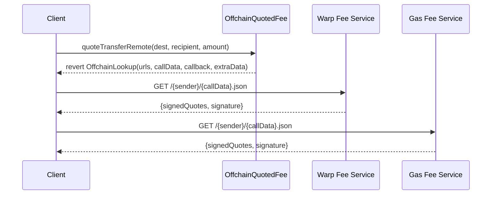
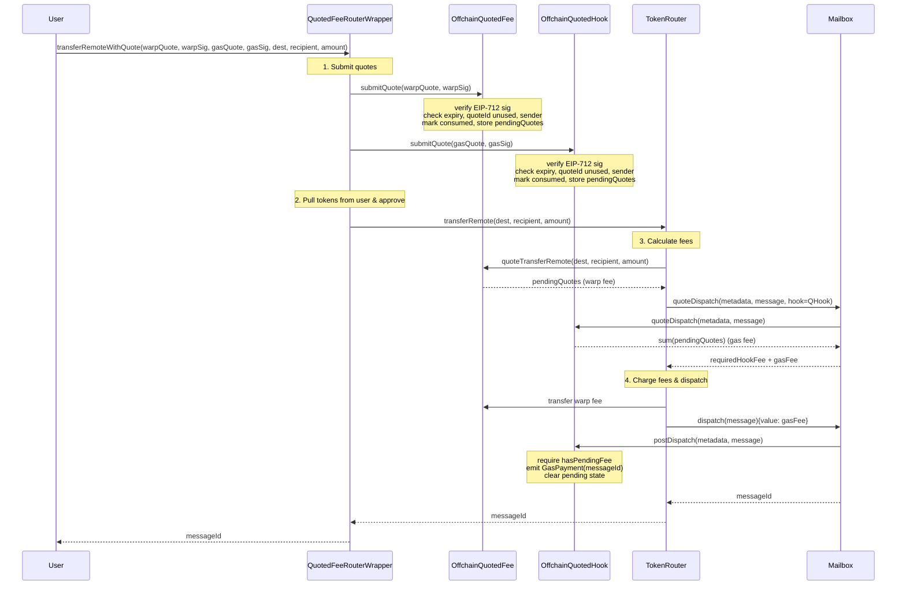
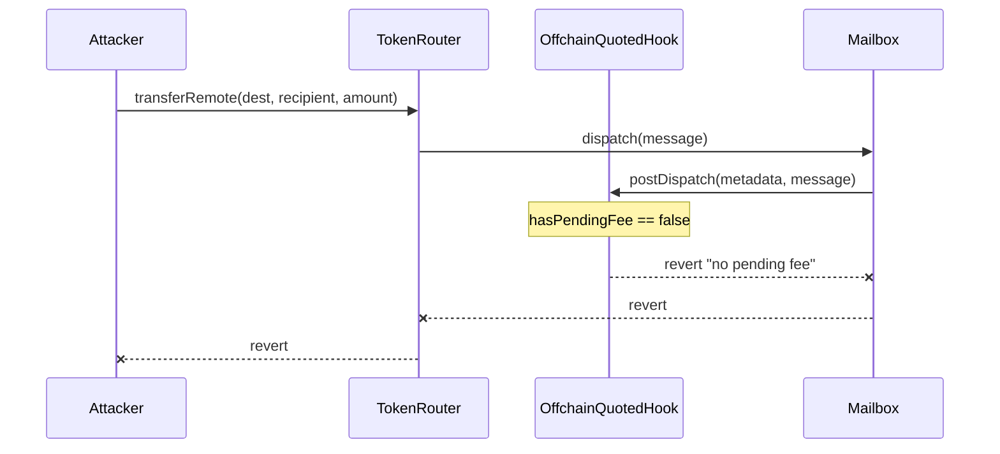

# Real-Time Warp Route Fees via Offchain Quoting

## Context

Current warp route fees use onchain-configured models (Linear, Progressive, Regressive) and StorageGasOracle for IGP. These can't react to real-time market conditions. This leads to overpaying or failed relaying.

**Goal**: Offchain quoting service signs real-time fee quotes; onchain contracts verify signatures and return the authorized quote. Uses CCIP-Read (ERC-3668) for quote discovery.

**Key requirements**:

- Differential pricing per user/frontend/partner (entirely offchain logic)
- Independent signatures for IGP and warp fee (separate signers, services, expiry)
- Abstract base contract shared by both fee types
- Strict one-use quote semantics via `consumedQuotes` mapping

## Signed Quote (EIP-712)

```solidity
struct SignedQuotes {
    bytes32 quoteId;    // unique, one-use (strict replay prevention)
    Quote[] quotes;     // array of {token, amount} — returned verbatim
    uint256 expiry;     // block.timestamp deadline
    address sender;     // front-running protection
}

// Existing type from ITokenBridge.sol:
struct Quote {
    address token;      // address(0) for native
    uint256 amount;
}
```

Minimal — everything else is implicit:

- **Contract + chain binding**: EIP-712 domain separator includes `(chainId, verifyingContract)`. A signature for `OffchainQuotedFee` at address X is invalid for `OffchainQuotedHook` at address Y.
- **Fee token**: Determined by the `quotes` array itself (supports multi-token fees natively).
- **Transfer params** (`destination`, `recipient`, `transferAmount`, `clientId`): Offchain concerns only. The signer prices the quote based on these, but they are not enforced onchain.

## Architecture

### Contract Hierarchy

```
AbstractOffchainQuoter (abstract, EIP712)
  ├── EIP-712 signature verification
  ├── consumedQuotes[quoteId] mapping (strict one-use)
  ├── pending Quote[] storage (set before transfer, cleared after)
  ├── reentrancy guard for quote lifecycle
  └── CCIP-Read OffchainLookup support

OffchainQuotedFee is AbstractOffchainQuoter, ITokenFee
  ├── set as feeRecipient on warp route
  ├── quoteTransferRemote() → returns pending quotes or OffchainLookup revert
  └── claim() for fee collection

OffchainQuotedHook is AbstractOffchainQuoter, AbstractPostDispatchHook
  ├── set as hook on warp route (replaces IGP)
  ├── _quoteDispatch() → returns sum of pending quote amounts
  ├── _postDispatch() → bypass prevention, clears state
  └── claim() for fee collection

QuotedFeeRouterWrapper
  ├── user entry point (transferRemoteWithQuote)
  ├── calls quotedFee.submitQuote() + quotedHook.submitQuote()
  ├── then calls warpRoute.transferRemote()
  ├── token handling (pull from user, approve to warp route)
  └── execute() escape hatch for owner
```

### `AbstractOffchainQuoter`

```solidity
abstract contract AbstractOffchainQuoter is Ownable, EIP712 {
    // --- Storage ---
    address public quoteSigner;
    mapping(bytes32 => bool) public consumedQuotes;
    string[] internal _urls;

    // --- Mid-transfer state (cleared after use) ---
    Quote[] internal _pendingQuotes;
    bool internal _hasPendingFee;

    // --- Signed quote ---
    struct SignedQuotes {
        bytes32 quoteId;
        Quote[] quotes;
        uint256 expiry;
        address sender;
    }

    // --- Core ---

    /// @notice Verify signature, mark quoteId consumed, store pending quotes
    function submitQuote(SignedQuotes calldata sq, bytes calldata signature) external {
        require(!_hasPendingFee, "reentrancy");
        require(block.timestamp <= sq.expiry, "expired");
        require(!consumedQuotes[sq.quoteId], "consumed");
        require(sq.sender == tx.origin, "sender mismatch");
        address signer = ECDSA.recover(
            _hashTypedDataV4(_hashSignedQuotes(sq)),
            signature
        );
        require(signer == quoteSigner, "invalid signer");

        consumedQuotes[sq.quoteId] = true;
        _pendingQuotes = sq.quotes;
        _hasPendingFee = true;
    }

    /// @notice Get pending quotes array
    function _getPendingQuotes() internal view returns (Quote[] memory) {
        return _pendingQuotes;
    }

    /// @notice Clear all pending state
    function _clearPending() internal {
        delete _pendingQuotes;
        _hasPendingFee = false;
    }

    /// @notice Require pending fee exists, then clear (bypass prevention)
    function _requireAndClearPending() internal {
        require(_hasPendingFee, "no pending fee");
        _clearPending();
    }

    // --- Admin ---
    function setQuoteSigner(address _signer) external onlyOwner { ... }
    function setUrls(string[] memory __urls) external onlyOwner { ... }
}
```

### `OffchainQuotedFee`

```solidity
contract OffchainQuotedFee is AbstractOffchainQuoter, ITokenFee {
    /// @notice Returns pending quotes during transfer, or reverts with OffchainLookup
    function quoteTransferRemote(uint32, bytes32, uint256)
        external view returns (Quote[] memory)
    {
        if (_hasPendingFee) return _getPendingQuotes();
        revert OffchainLookup(address(this), _urls, _callData(), this.quoteCallback.selector, "");
    }

    function claim(address beneficiary) external onlyOwner { ... }
}
```

### `OffchainQuotedHook`

```solidity
contract OffchainQuotedHook is AbstractOffchainQuoter, AbstractPostDispatchHook {
    /// @notice Returns sum of pending quote amounts for hook fee
    function _quoteDispatch(bytes calldata, bytes calldata)
        internal view override returns (uint256)
    {
        if (!_hasPendingFee) return 0;
        Quote[] memory quotes = _getPendingQuotes();
        uint256 total;
        for (uint256 i; i < quotes.length; i++) total += quotes[i].amount;
        return total;
    }

    /// @notice Bypass prevention — reverts if no quote was submitted
    function _postDispatch(bytes calldata, bytes calldata message)
        internal override
    {
        _requireAndClearPending();
        emit GasPayment(message.id());
    }

    function claim(address beneficiary) external onlyOwner { ... }
}
```

### `QuotedFeeRouterWrapper`

```solidity
contract QuotedFeeRouterWrapper is Ownable {
    TokenRouter public immutable warpRoute;
    OffchainQuotedFee public immutable quotedFee;
    OffchainQuotedHook public immutable quotedHook;
    IERC20 public immutable token;
    TokenType public immutable tokenType;

    function transferRemoteWithQuote(
        SignedQuotes calldata warpQuote, bytes calldata warpSig,
        SignedQuotes calldata gasQuote, bytes calldata gasSig,
        uint32 destination, bytes32 recipient, uint256 amount
    ) external payable returns (bytes32) {
        // 1. Submit both quotes (sets pending fees on each contract)
        quotedFee.submitQuote(warpQuote, warpSig);
        quotedHook.submitQuote(gasQuote, gasSig);

        // 2. Pull tokens from user, approve to warp route
        // (collateral/synthetic/native handling based on tokenType)

        // 3. Call warp route — internally reads pending fees from both contracts
        bytes memory encoded = abi.encodeWithSelector(
            TokenRouter.transferRemote.selector, destination, recipient, amount
        );
        (bool ok, bytes memory ret) = address(warpRoute).call{value: msg.value}(encoded);
        require(ok);

        return abi.decode(ret, (bytes32));
    }

    /// @notice Escape hatch for owner — arbitrary calls without upgradeability
    function execute(address target, bytes calldata data, uint256 value)
        external onlyOwner returns (bytes memory)
    {
        (bool ok, bytes memory ret) = target.call{value: value}(data);
        require(ok);
        return ret;
    }
}
```

## Sequence Diagrams

### Quote Discovery (CCIP-Read)



### Transfer Execution



### Bypass Attempt (Reverts)



## Deployment

1. Deploy `OffchainQuotedFee(signer, urls)`
2. Deploy `OffchainQuotedHook(signer, urls)`
3. Deploy `QuotedFeeRouterWrapper(warpRoute, quotedFee, quotedHook)`
4. `warpRoute.setFeeRecipient(address(quotedFee))`
5. `warpRoute.setHook(address(quotedHook))`

Existing warp routes can be "upgraded" to offchain quoting by setting the new fee recipient and hook — no redeployment of the warp route needed.

## Relayer Dual-Mode

Relayer detects mode per warp route:

- **Quoted mode**: `hookType()` == `OFFCHAIN_QUOTED_HOOK`. Relayer trusts the quoted fee covers gas. No IGP payment check.
- **IGP mode**: Standard `InterchainGasPaymaster` hook. Business as usual.

Both modes coexist across different warp routes. This is a relayer config/detection change, not a protocol change.

## Offchain Quoting Service(s)

Can be one service returning both quotes, or two independent services:

**Warp fee service** (operated by warp route owner):

- Computes protocol margin based on `(sender, clientId, amount, destination)`
- Signs `SignedQuotes` with `warpFeeSigner` key
- EIP-712 domain points to `OffchainQuotedFee` contract address

**Gas fee service** (operated by relayer):

- Fetches real-time gas prices, exchange rates from destination chain
- Computes relay cost + margin, accounting for mailbox `requiredHook` fee
- Signs `SignedQuotes` with `gasFeeSigner` key
- EIP-712 domain points to `OffchainQuotedHook` contract address

Both services: CCIP-Read compatible HTTP endpoints (`GET /{sender}/{data}.json`), EIP-712 signing, configurable TTL.

## Security Properties

| Property                 | Mechanism                                                   |
| ------------------------ | ----------------------------------------------------------- |
| Replay prevention        | `consumedQuotes[quoteId]` mapping (strict one-use)          |
| Front-running protection | `sender` field in signed quote, checked against `tx.origin` |
| Cross-contract replay    | EIP-712 domain separator includes `verifyingContract`       |
| Cross-chain replay       | EIP-712 domain separator includes `chainId`                 |
| Bypass prevention        | `_postDispatch()` reverts if `hasPendingFee == false`       |
| Reentrancy               | `_hasPendingFee` flag prevents `submitQuote()` while active |
| Quote expiry             | `block.timestamp <= expiry` check in `submitQuote()`        |
| Signer authorization     | `ECDSA.recover` against owner-configured `quoteSigner`      |

## Files to Create/Modify

| File                                                             | Action                          |
| ---------------------------------------------------------------- | ------------------------------- |
| `solidity/contracts/hooks/AbstractOffchainQuoter.sol`            | Create — abstract base          |
| `solidity/contracts/token/fees/OffchainQuotedFee.sol`            | Create — ITokenFee impl         |
| `solidity/contracts/hooks/OffchainQuotedHook.sol`                | Create — IPostDispatchHook impl |
| `solidity/contracts/token/extensions/QuotedFeeRouterWrapper.sol` | Create — entry point            |
| `solidity/contracts/interfaces/hooks/IPostDispatchHook.sol`      | Modify — add hook type          |
| `solidity/test/token/OffchainQuoting.t.sol`                      | Create — Forge tests            |

## Key References

- `solidity/contracts/token/extensions/PredicateRouterWrapper.sol` — wrapper pattern
- `solidity/contracts/isms/ccip-read/AbstractCcipReadIsm.sol` — OffchainLookup pattern
- `solidity/contracts/hooks/igp/InterchainGasPaymaster.sol` — IGP hook model
- `solidity/contracts/token/libs/TokenRouter.sol` — `_feeRecipientAndAmount()`, `_quoteGasPayment()`
- `solidity/contracts/client/Router.sol` — `_Router_quoteDispatch()` → `mailbox.quoteDispatch()`
- `solidity/contracts/token/fees/BaseFee.sol` — ITokenFee interface
- `solidity/contracts/hooks/libs/AbstractPostDispatchHook.sol` — hook base
- `solidity/contracts/interfaces/ITokenBridge.sol` — `Quote` struct, `ITokenFee` interface

## Verification

1. **Unit**: `AbstractOffchainQuoter` — sig verify, quoteId replay, expiry, sender check, reentrancy guard
2. **Integration**: `OffchainQuotedFee` returns pending quotes via `quoteTransferRemote()`
3. **Integration**: `OffchainQuotedHook` returns pending amount via `_quoteDispatch()`, clears in `_postDispatch()`
4. **E2E**: Wrapper submits both quotes, warp route reads both fees, dispatch succeeds
5. **Security**: bypass (direct `transferRemote()`) → `_postDispatch` reverts; wrong signer → reverts; replayed quoteId → reverts
